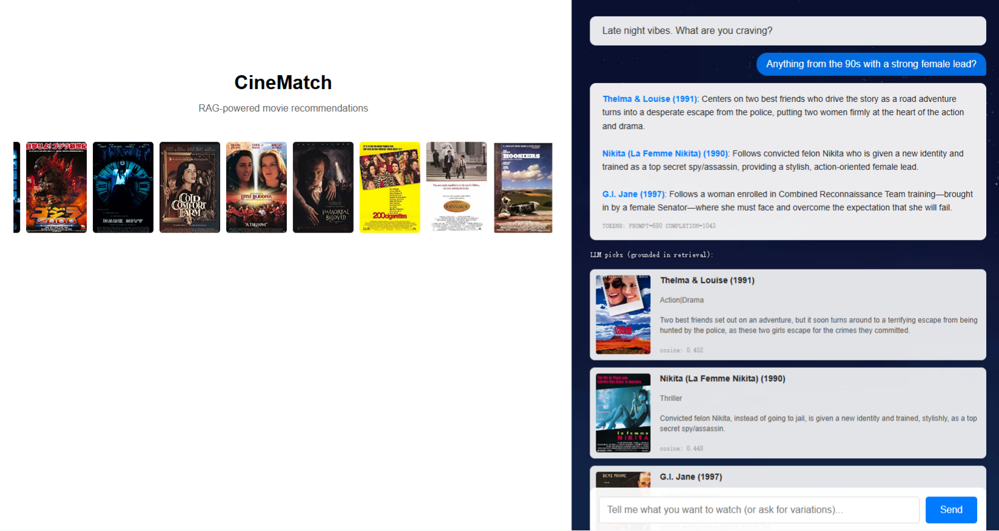

# CineMatch-RAG

A movie recommender that uses semantic vector search + a grounded LLM
to answer free-form queries like "I just broke up, want something
cathartic" or "dark psychological thriller with a twist ending."

Built on Azure OpenAI (embeddings + generation) and FAISS for local
vector retrieval. Multi-turn conversation — the LLM keeps context
across turns and won't repeat earlier recommendations.



## Stack

- Python 3.10+
- Azure OpenAI: `text-embedding-3-small` (1536-dim) + `gpt-5-mini`
- FAISS (`IndexFlatIP`, exact cosine search)
- Flask
- MovieLens-1M + IMDB plot summaries (~2,945 movies after filtering)

## How it works

There are two pipelines.

**Offline** (`build_index.py`, run once): load movies, concatenate
title/genres/intro into one string per movie, batch-call the embedding
API, store the resulting 1536-dim vectors in a FAISS index. Metadata
(title, genres, intro) lives in a parallel pickle file — FAISS only
knows vector + integer ID, so we look up the actual movie data by ID.

**Online** (`rag_pipeline.py`, per query): embed the user's query, do a
top-K cosine search in FAISS, pull the matching metadata, drop it all
into a prompt, and let `gpt-5-mini` pick 3 movies and explain why.
The system prompt explicitly forbids inventing plot details or
recommending anything not in the retrieved list.

Conversation history is held in memory as OpenAI message format and
fed back on every turn, so follow-ups like "give me three more, but
lighter" actually work.

## Run it

```bash
pip install -r requirements.txt
cp .env.example .env
# Fill in your Azure endpoint, key, and deployment names
python build_index.py     # one-time, ~2 minutes
python app.py
# open http://127.0.0.1:5000/
```

You'll need MovieLens-1M under `data/ml-1m/` —
[download here](https://grouplens.org/datasets/movielens/1m/).

## Evaluation

`evaluate.py` runs 10 synthetic queries with genre-based heuristic
ground truth (a result counts as relevant if its genres overlap with
the query's intended genre).

| Metric                          | Value             |
| ------------------------------- | ----------------- |
| precision@1                     | 0.900             |
| precision@5                     | 0.900             |
| precision@10                    | 0.890             |
| Retrieval latency mean / P95    | 346 ms / 1,304 ms |
| End-to-end latency mean / P95   | 10.7 s / 18.3 s   |
| Avg prompt / completion tokens  | 689 / 893         |
| Cost per query                  | ~$0.00196         |


## Local MVP vs production

| Layer | Now (local) | Production target |
|---|---|---|
| Embedding + LLM | Azure OpenAI | Azure OpenAI |
| Vector store | FAISS | Azure AI Search (vector + BM25 + filters) |
| Structured data | pickle | Cosmos DB |
| Offline indexing | local script | Azure Databricks |
| App hosting | Flask localhost | Azure App Service |

The `MovieRetriever` class is an interface — swapping FAISS for Azure
AI Search means replacing one implementation, not redesigning the
pipeline. That was a deliberate choice during the MVP; at ~3,000
movies a cloud vector store would have been overkill (FAISS searches
in under 10 ms), but designing for the migration kept the option open.

## Future work

In rough priority order:

1. Add SVD as a candidate generation layer for logged-in users.
2. Switch the LLM to JSON mode + return movie IDs (kills the title
   matching problem).
3. Run RAGAS faithfulness for automated hallucination detection.
4. Migrate vector store to Azure AI Search at scale.
5. Switch generation model to a non-reasoning one for ~10× cost cut.
6. Persist conversations in Cosmos DB.

## Data

- [MovieLens-1M](https://grouplens.org/datasets/movielens/1m/) from
  GroupLens Research.
- Plot summaries scraped from IMDB.
